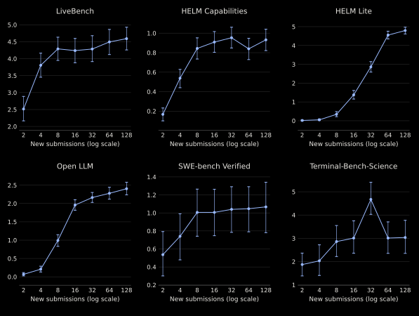
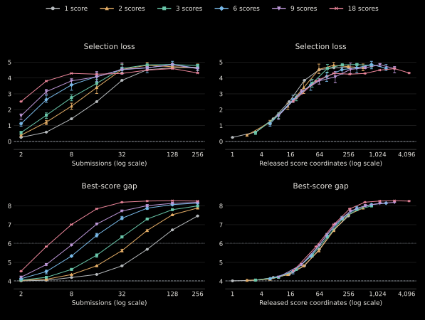

# Fast but False Progress on Benchmarks with Richer Feedback

Stress-test whether repeated public benchmark feedback preserves **best-score generalization** and **best-model selection**. This code repository is meant to accompany the [website](https://false-benchmark-progress.com/). In particular, it features a simple entry point to stress-test your own benchmark locally; see the "Stress-test another benchmark" section below.

We find that following the public ranking after 128 leaderboard submissions lowers the selected model’s held-out score by **0.93–4.80 percentage points** across six benchmark snapshots. Model-selection loss compares that choice with the genuine public winner chosen before attack.



The [website](https://false-benchmark-progress.com/) presents score accuracy and selection quality separately, and walks through the attack we implement, which we sketch below.

```text
Choose two public endpoint models
                 ↓
Submit random binary routers
                 ↓
Use released task scores to construct the final router
```

The attack receives public task profiles and prompt/task metadata, never private item answers or scores. Each task score reflects how the two endpoints differ on the reused benchmark. The task-linear decoder combines these scores.

On LiveBench for example, mean selection loss at eight submissions is **1.43 pp with one returned score** and **4.29 pp with eighteen**. We also find that coarser feedback delays harm but does not remove it.



Curves average three balanced task groupings; bars show their range.

<details>
<summary>Methods and supporting results</summary>

The [model-selection notes](https://github.com/ysfalh/false-benchmark-progress/blob/main/docs/selection_loss.md) define the metric and link to complete results and paired trials. The [threat model](https://github.com/ysfalh/false-benchmark-progress/blob/main/docs/threat_model.md) specifies what information the attack can access.

The [controlled-study methods](https://github.com/ysfalh/false-benchmark-progress/blob/main/docs/feedback_dimension.md) explain how feedback richness varies while the model pairs and routing rules stay fixed.

</details>

## Reproduce our results

Python 3.9–3.12:

```bash
python -m venv .venv
source .venv/bin/activate
python -m pip install --upgrade pip
python -m pip install -e '.[test,site]'
python -m scripts.verify results/release_v2 --allow-code-changes
python -m scripts.reproduce --benchmark livebench
python -m scripts.verify results/release_v2 --allow-code-changes --run runs/livebench
```

The corresponding commands are:

```bash
python -m scripts.reproduce --benchmark helm_capabilities
python -m scripts.reproduce --benchmark helm_lite
python -m scripts.reproduce --benchmark openllm_v2
python -m scripts.reproduce --benchmark swe_verified
python -m scripts.reproduce --benchmark terminal_science
```

Each runs 250 partitions and all reported budgets using the snapshot’s recorded endpoint policy. The five original snapshots include both endpoint policies; the outcome bank uses the top-five Pareto policy, with ineligible partitions retained. Compact item scores are bundled; no model calls, downloads, or leaderboard access are needed. Outputs go under `runs/`; choose a new `--output` directory when repeating a run.

<details>
<summary>Verification scope and derived metrics</summary>

Released records suffice to independently check endpoint selection, final ranks, score generalization gap, and held-out score gaps, and regenerate all bootstrap summaries. `--inputs` additionally reconstructs genuine-model public feedback from item scores; `--run` compares a complete rerun, including candidate routing and feedback. See [verification details](https://github.com/ysfalh/false-benchmark-progress/blob/main/docs/reproducibility.md) for the limits of each check.

Checksums cover the packaged inputs, result files, and source code. `--allow-code-changes` permits local Python edits while still requiring every input and result checksum and running the numerical checks. Omit it to check the packaged source files as well.

The website derives model-selection loss separately from those records, including the static and endpoint controls and the practical policy comparison. `python site/build.py` rebuilds these summaries; `python -m pytest tests/test_selection_loss.py tests/test_presentation.py` checks them. Archived fields retain their original metric definitions. Verify and fully replay an outcome bank with `python -m scripts.verify_outcomes --benchmark terminal_science --rerun`.

</details>

## Stress-test another benchmark

Provide two functions: public genuine-model profiles, and public feedback for a submitted routing rule. Keep private scoring in your own evaluator; hidden data need not leave your environment. The same endpoint selector, prompt-hash routers, and task-linear decoder are reused through a [small adapter](https://github.com/ysfalh/false-benchmark-progress/blob/main/docs/adapter.md).

```bash
python -m scripts.maintainer_report --policy category --budget 8 --output runs/maintainer-example
```

Open `runs/maintainer-example/report.html` for feedback policy, coverage, no-attack and attack outcomes, and reproduction details. The [synthetic example](https://github.com/ysfalh/false-benchmark-progress/blob/main/examples/custom_benchmark/run.py) defines the feedback surface, runs eight submissions, then computes score generalization gap and model-selection outcomes. It requires no external data and runs in seconds.

<details>
<summary>Benchmark sources and licenses</summary>

The [data provenance notes](https://github.com/ysfalh/false-benchmark-progress/blob/main/docs/data_sources.md) identify the source snapshots and their terms. The [historical benchmark interfaces](https://github.com/ysfalh/false-benchmark-progress/blob/main/docs/benchmark_interfaces.md) document score aggregation and precision.

</details>

Code and original documentation are MIT licensed; dataset and font terms are separate.

## Citation

If you use the website, software, or results, please cite:

```bibtex
@misc{allouah_duchi_koyejo_benchmark_progress,
  author = {Allouah, Youssef and Duchi, John and Koyejo, Sanmi},
  title = {Fast but False Progress on Benchmarks with Richer Feedback},
  year = {2026},
  howpublished = {Research artifact and software, version 0.1.0},
  url = {https://false-benchmark-progress.com}
}
```

For the formal problem formulation or theoretical limitations, please cite the [theory paper](https://arxiv.org/abs/2609.32109):

```bibtex
@misc{allouah_duchi_benchmark_reuse,
  author = {Allouah, Youssef and Duchi, John},
  title = {How Reusable Are Benchmarks with Richer Feedback?},
  year = {2026},
  howpublished = {arXiv preprint arXiv:2609.32109},
  eprint = {2609.32109},
  archivePrefix = {arXiv},
  url = {https://arxiv.org/abs/2609.32109}
}
```

<details>
<summary>Citation files</summary>

These entries are also available in [docs/citations.bib](https://github.com/ysfalh/false-benchmark-progress/blob/main/docs/citations.bib). Software citation metadata is in [CITATION.cff](https://github.com/ysfalh/false-benchmark-progress/blob/main/CITATION.cff).

</details>
