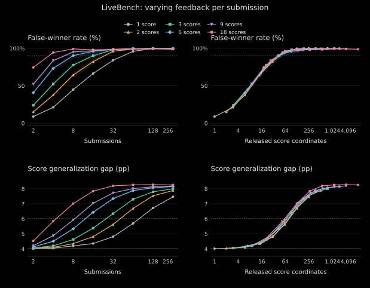
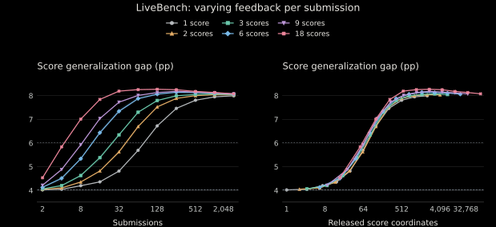

# Controlled LiveBench feedback dimension

Increasing the released profile from 1 to 18 coordinates reduces the first tested submission budget reaching a 90% false-winner rate from 64 to 4. Re-indexing the same outcomes by released score coordinates contracts this 16× spread to 1.5×. For this fixed attack, much of the submission-efficiency advantage is explained by how many score coordinates the leaderboard returns per submission. This is an empirical collapse for this attack and benchmark, not a general information law.

This study reports false-winner rates and score gaps. A false winner ranks first reused but not held out; that event alone does not say whether following the new ranking worsens the original model choice. The website's separate [model-selection loss](selection_loss.md) answers that question.



## Controlled protocol

The experiment uses 250 paired LiveBench trials, 204 items on the reused split (S), 408 on the held-out split (T), and the same 33 genuine models. Endpoints are selected once per trial by the original public full-task top-five Pareto-frontier + max-MAD rule, then frozen across dimensions. This intentionally gives coarse interfaces the same favorable endpoints. The original random routing rules, task metadata, tie rules, and budgets (1, 2, 4, …, 2048) remain fixed. A budget k includes k−1 candidate submissions followed by the final router; existing genuine/endpoint profiles are free.

**Grouping in one sentence:** for partition p=0,1,2, sort the 18 full category/task names by SHA256(`livebench-bandwidth-v1-partition-{p}|{name}`), break hash ties lexically, and divide the permutation into d contiguous groups of size 18/d, for d=1,2,3,6,9,18.

The fixed domain string is retained for reproduction. Exact mappings are in `groupings.json`; the original protocol and mapping hashes were frozen before new outcomes were computed. Grouping never uses model scores or semantics. The same permutation applies across dimensions. Partitions are nested when one dimension divides another; not all pairs of dimensions are refinements. The three d=1 conditions coincide; d=18 conditions differ only by coordinate permutation. Explicit aliases retain all 18 logical conditions, with 14 unique conditions and 42,000 unique outcomes. Partitions and aliases do not create additional independent trials.

Each group score averages its constituent **published** task scores equally. Convert original public scores to integer ticks of 1/100000, average the ticks exactly, then round to the nearest integer, ties to even. Every dimension uses 0.001 percentage-point precision. The synthetic scalar is an equal-task mean, unlike the historical equal-category scalar; the six-coordinate condition uses arbitrary balanced groups, unlike the six semantic categories.

For group g and candidate t, the existing loss-residual decoder uses α(t,g)=(a(g)+b(g))/2−r(t,g). In score coordinates the identical routing rule uses the positive rescaling 2r−a−b. Each prompt receives its public task's group coefficient. The implementation calls the existing exact-integer `fit_rule` and `LinearRule`; at k=1 it selects the stronger endpoint per group, retaining prompt-hash ties. Every condition's rules are saved before T evaluation.

Evaluation remains equal-category throughout: genuine models plus the final router determine ranks, ties share first place, and score generalization gap compares the separate running-best S/T histories. The final router never consumes its evaluation feedback. The quantity **I=d(k−1)** counts released score coordinates across candidate submissions only; it excludes free genuine/endpoint profiles and the final evaluation.

## Curves and descriptive thresholds

Lines average the three grouping-specific means. Canonical tables also retain partition ranges and 2,000 descriptive percentile bootstrap intervals, using the same 250 trial indices across conditions (seed 2026081900). Overlapping splits limit interpretation of those intervals.

| Dimension | 90% false-winner rate: submissions | Released coordinates | Score gap baseline +1 pp: submissions | Released coordinates | Score gap baseline +2 pp: submissions | Released coordinates |
| ---: | ---: | ---: | ---: | ---: | ---: | ---: |
| 1 | 64 | 63 | 64 | 63 | 128 | 127 |
| 2 | 32 | 62 | 32 | 62 | 64 | 126 |
| 3 | 16 | 45 | 16 | 45 | 32 | 93 |
| 6 | 8 | 42 | 8 | 42 | 16 | 90 |
| 9 | 8 | 63 | 8 | 63 | 16 | 135 |
| 18 | 4 | 54 | 4 | 54 | 8 | 126 |

Both score-gap thresholds are descriptive increases above the genuine-model baseline, using the same trial averages.

The threshold grid is coarse. Individual d=3 and d=6 partitions also cross 90% at different tested budgets; no favorable partition was selected. The primary table uses their predeclared mean curves.



Score gap curves align substantially, though less tightly than the false-winner rate curves. Static controls at I=0 are retained separately and never connected into coordinate-axis curves.

All six naturally matched positive coordinate counts on the tested grid are retained in `exact_coordinate_matches.csv`. Score-gap differences are at most 0.313 pp; three of six paired 95% intervals exclude zero. All six false-winner-rate intervals include zero. These comparisons were added as a supplementary all-grid check after the primary analysis, not selected for significance; they do not establish equivalence or a universal scaling law. Remaining differences could reflect free initial profiles, task grouping, or usefulness of individual coordinates.

## Canonical release and reproduction

All filenames below are relative to [`results/feedback_dimension_v1/`](../results/feedback_dimension_v1/). The numerical `release_v1` records are preserved.

- `protocol.json`, `protocol_lock.json`, `groupings.json`: configuration, package integrity hashes, and every exact task-group mapping.
- `trials.parquet`, `evaluation.npz`, `routing_records.json`: all unique trial outcomes, compact scoring histories, and source hashes of every released table/final routing decision with fitted-rule records.
- `dimension_budget_curves.csv`, `partition_budget_curves.csv`, `thresholds.csv`, `static_controls.csv`: complete curves, uncertainty, partition variation, and crossings.
- `exact_coordinate_matches.csv`: all naturally matched positive coordinate counts and their descriptive paired intervals.
- `provenance.json`, `checksums.json`: descriptions and integrity hashes of the packaged records.

The package retains compact evaluation records and hashes of the released feedback tables and final routing decisions. The full reproduction checks all 25,704,000 final routing decisions and released tables exactly. Floating aggregates allow 1e−10 pp of summation-order roundoff.

```bash
python -m scripts.verify_feedback
python -m scripts.reproduce_feedback --output runs/feedback_dimension
python -m scripts.report_feedback --output runs/feedback_tables
python site/build.py
```

The full reproduction runs all 250 trials and every distinct task grouping, compares public tables, routing decisions, and outcomes to canonical records, and checks d=18 against `release_v1`. `--dimensions 18` selects a cheaper reference rerun. Existing output directories are refused.

The verifier recomputes metrics from compact traces and regenerates primary/partition summaries, thresholds, and exact-coordinate intervals. The full attack reproduction additionally rebuilds feedback tables and final routing decisions from item scores.

## Model-selection loss

The website also derives the signed held-out score difference between the original public-selected model and the public choice after adding the final router. It uses the same frozen scoring records, with ties favoring genuine models. Evaluation remains the mean of the six original categories, independently of the feedback grouping. Curves average the three grouping-specific means; bars show their range. `python site/build.py` regenerates the trial values, summaries, and paired intervals in `site/data/feedback_selection_*`. The 18-score condition matches the original LiveBench selection-loss trials.
